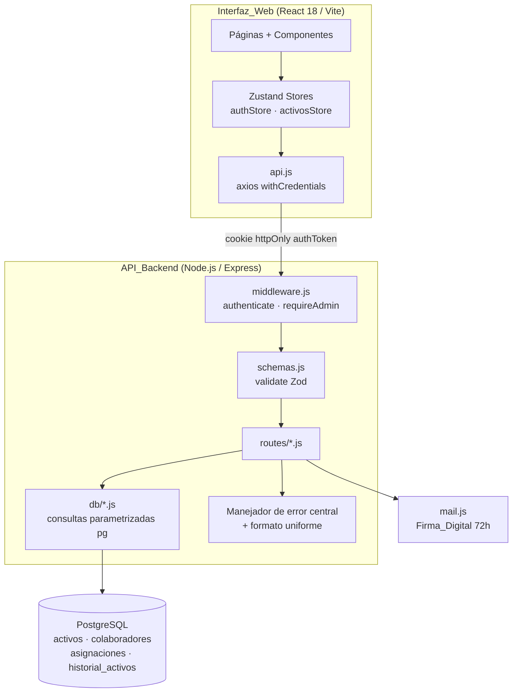
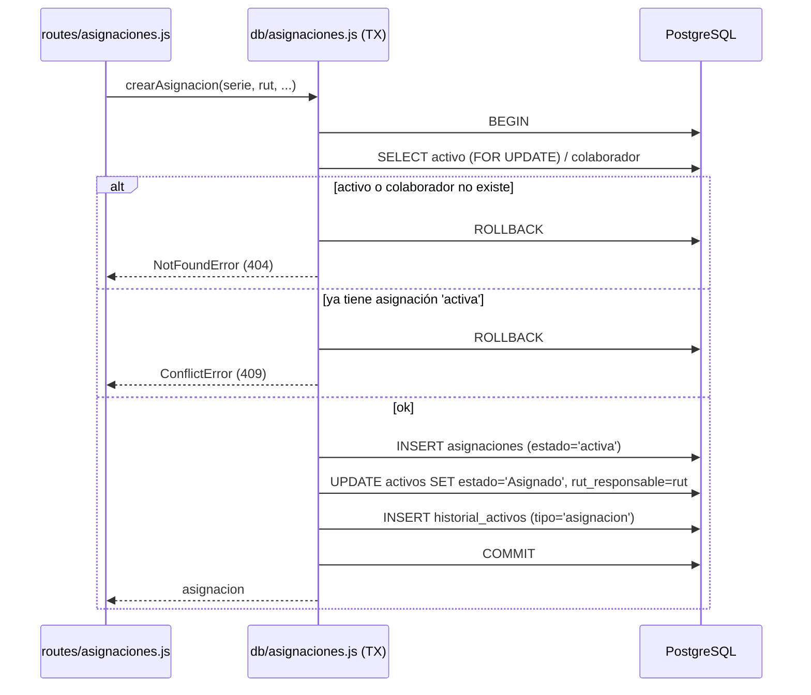

# Documento de Diseño — Mejora Integral del Inventario (IT COMPASS)

## Overview

Este diseño describe **cómo** se implementarán las mejoras definidas en `requirements.md` sobre el sistema IT COMPASS existente (backend Node.js/Express + PostgreSQL, frontend React 18/Vite/Zustand/Tailwind). El objetivo del usuario es eliminar la sensación de que "falta información, orden en los flujos y orden en las asignaciones", cubriendo además los ejes transversales de rendimiento, seguridad, calidad y UX.

El sistema **ya está construido y en producción**. Por lo tanto, este diseño es predominantemente **evolutivo y correctivo**: la mayoría de los cambios son ajustes quirúrgicos sobre archivos que ya existen, no reescrituras. Las decisiones se anclan al código real revisado:

- **Backend**: `app.js` (montaje de rutas y manejador de errores central), `middleware.js` (auth JWT + `COOKIE_OPTIONS`), `schemas.js` (validación Zod + `validarRut`), capa `db/` (módulos por dominio con `pg` `query` parametrizado), `routes/` (controladores REST).
- **Frontend**: `api.js` (cliente axios con `withCredentials`), `App.jsx` (React Router + lazy loading), `store/` (Zustand `authStore`, `activosStore`), `components/` (modales, `Sidebar`), `pages/`.

Hallazgos clave de la exploración que condicionan el diseño:

1. **La tabla `asignaciones` ya existe** (migración `004_asignaciones.sql`) con el ciclo de vida completo (`activa`, `pendiente_firma`, `cerrada`, `cancelada`), `token_confirmacion`, `token_expira_at` y `confirmado_at`. El flujo de asignación/devolución/firma en `routes/asignaciones.js` **ya usa transacciones** (`BEGIN`/`COMMIT`/`ROLLBACK`). El trabajo aquí es **endurecer y completar** ese flujo, no crearlo (Req. 6, 7, 8, 14).
2. **Doble camino de asignación**: existe el flujo transaccional correcto en `routes/asignaciones.js`, pero `db/activos.js` (`updateActivo`) también crea/cierra asignaciones al editar `rut_responsable` **fuera de transacción**. Esto es una fuente directa de inconsistencias estado/asignación (Req. 14).
3. **Validación inconsistente**: `routes/activos.js` y `routes/colaboradores.js` usan el middleware `validate(schema)` de Zod, pero `routes/asignaciones.js` valida a mano (`if (!serie_activo …)`). Falta uniformidad (Req. 12.1, 13.2).
4. **Formato de error heterogéneo**: cada ruta responde `{ error: '…' }` con mensajes ad-hoc; no hay un identificador de tipo de error ni estructura común (Req. 13.2).
5. **Sin paginación**: `getActivos`, `getColaboradores`, `getAsignaciones` devuelven listas completas sin `LIMIT`/`OFFSET` ni total (Req. 9).
6. **`COOKIE_OPTIONS` ya cumplen** `httpOnly`, `secure`, `sameSite: 'strict'`, `maxAge: 8h` (Req. 11.4). El logout ya limpia la cookie. Falta invalidación en servidor de tokens vigentes (Req. 11.5).
7. **Lazy loading ya implementado** en `App.jsx` con `React.lazy`/`Suspense` (Req. 10.4). El store Zustand ya cachea listas (Req. 10.1) pero recarga siempre; falta control de invalidación explícito (Req. 10.2).

## Architecture

### Arquitectura general (sin cambios estructurales)



Los cinco frentes de la revisión se mapean sobre capas ya existentes; no se introduce ninguna capa nueva. Los cambios son:

| Capa | Archivos afectados | Naturaleza del cambio |
|------|--------------------|-----------------------|
| Esquema BD | `schema.sql`, nuevo `migrations/006_mejoras_integrales.sql` | Índices nuevos, columnas de completitud/consistencia |
| Capa de datos | `db/activos.js`, `db/colaboradores.js`, `db/asignaciones.js` (nuevo módulo), `db/historial.js` | Paginación, evitar N+1, transacciones atómicas centralizadas |
| Contratos API | `routes/*.js`, nuevo `lib/apiError.js`, nuevo `lib/paginate.js` | Formato de error uniforme, paginación, validación Zod uniforme |
| Middleware/seguridad | `middleware.js`, `routes/auth.js`, `schemas.js` | Denylist de tokens en logout, `sanitize` de respuestas de usuario, logging seguro |
| Frontend | `store/*.js`, `components/*`, `pages/*`, nuevos hooks/util | Indicadores de completitud, breadcrumbs, feedback, debounce, estados vacíos, accesibilidad |

### Flujo transaccional unificado de Asignaciones (Req. 7, 8, 14)

Se **centraliza** toda la lógica de ciclo de vida de asignaciones en un nuevo módulo `db/asignaciones.js` que expone funciones transaccionales. `routes/asignaciones.js` pasa a ser un controlador delgado, y `db/activos.js#updateActivo` **deja de crear/cerrar asignaciones**: cuando el operador cambia el responsable desde la ficha de activo, el controlador redirige a las mismas funciones transaccionales de asignación. Esto elimina el doble camino que causa inconsistencias.



El uso de `SELECT ... FOR UPDATE` sobre la fila del activo dentro de la transacción evita condiciones de carrera en las que dos solicitudes concurrentes creen dos asignaciones activas para el mismo equipo (Req. 7.1).

## Components and Interfaces

### Backend — utilidades transversales nuevas

**`lib/apiError.js`** — formato de error uniforme (Req. 13.2, 12.3).

```js
class ApiError extends Error {
  constructor(status, type, message, details = null) {
    super(message);
    this.status = status;   // 400,401,403,404,409,410,500
    this.type = type;       // 'VALIDATION' | 'UNAUTHORIZED' | 'FORBIDDEN' | 'NOT_FOUND' | 'CONFLICT' | 'GONE' | 'INTERNAL'
    this.details = details; // p.ej. lista de campos faltantes
  }
}
// Helpers: ApiError.validation(msg, details), ApiError.notFound(msg), ApiError.conflict(msg)...
```

El manejador central de `app.js` se ajusta para serializar cualquier `ApiError` (o error genérico) a la estructura común:

```json
{ "error": { "type": "CONFLICT", "message": "El equipo ya está asignado", "details": null } }
```

Todos los controladores dejan de responder `res.status(x).json({ error: '…' })` y en su lugar lanzan/pasan `ApiError` a `next(err)`. El campo `stack` nunca se expone; en producción los `500` devuelven un mensaje genérico y el detalle real solo va a logs (Req. 12.3).

**`lib/paginate.js`** — normaliza parámetros de paginación (Req. 9.2, 9.3).

```js
function parsePagination(query) {
  let size = parseInt(query.pageSize, 10) || 50;      // default 50
  size = Math.min(Math.max(size, 1), 200);            // techo 200
  const page = Math.max(parseInt(query.page, 10) || 1, 1);
  return { limit: size, offset: (page - 1) * size, page, size };
}
```

**`lib/sanitizeUsuario.js`** — elimina `password`, `reset_token`, `reset_token_expires` de toda respuesta de usuario (Req. 12.4).

**`lib/logger.js`** — envoltura de logging que enmascara claves sensibles (`password`, `token`, `authToken`, `token_confirmacion`, `reset_token`) antes de escribir (Req. 12.5).

### Backend — contrato de listados paginados (Req. 9)

Los endpoints `GET /api/activos`, `GET /api/colaboradores`, `GET /api/asignaciones` aceptan query params `page`, `pageSize`, filtros y `q` (búsqueda). Respuesta:

```json
{
  "data": [ /* máx 50 por defecto, 200 tope */ ],
  "pagination": { "page": 1, "pageSize": 50, "total": 4820, "totalPages": 97 }
}
```

- El `total` se obtiene con una segunda consulta `COUNT(*)` que comparte los mismos filtros (o `COUNT(*) OVER()` en la misma consulta para ahorrar un round-trip).
- Página fuera de rango → `data: []` con `total` real (Req. 9.3).
- Los filtros se resuelven sobre columnas indexadas (Req. 9.4, ver Data Models).
- **Compatibilidad**: el frontend (`activosStore`) hoy espera un array plano (`response.data`). Se adapta el store para leer `response.data.data`, y los endpoints aceptan `?all=1` o ausencia de `page` para un modo no paginado durante la transición, o bien se migran los consumidores en el mismo cambio. Se decide **migrar los consumidores** para no dejar deuda.

### Backend — capa de datos: evitar N+1 (Req. 9.5)

Las consultas ya usan `LEFT JOIN` + `json_build_object` para traer el colaborador en una sola query (`db/activos.js#getActivos`), lo cual **ya evita N+1**. El diseño preserva ese patrón y lo extiende a asignaciones: el listado de activos con su asignación vigente se resuelve con un único `LEFT JOIN LATERAL` sobre `asignaciones` filtrando `estado='activa'`, sin consulta por fila.

### Backend — validación uniforme (Req. 12.1, 12.2)

Se añaden a `schemas.js` los esquemas Zod faltantes y se aplican como middleware `validate(...)` en **todos** los endpoints de escritura, incluido `routes/asignaciones.js`:

```js
const createAsignacionSchema = z.object({
  serie_activo:    z.string().min(1),
  rut_colaborador: rutSchema,
  entregado_por:   z.string().optional().nullable(),
  notas:           z.string().optional().nullable(),
});
const cerrarAsignacionSchema = z.object({
  motivo_devolucion:        z.string().optional().nullable(),
  estado_fisico_devolucion: z.enum(['Disponible','Mantenimiento','Descartado']).optional(),
  desvincular_colaborador:  z.boolean().optional(),
  correo_alterno:           z.string().email().optional().nullable(),
});
```

Todas las consultas siguen usando sentencias parametrizadas `$1..$n` (ya es el patrón vigente en toda la capa `db/`), lo que satisface Req. 12.2 por construcción.

### Backend — autenticación y sesión (Req. 11)

- `authenticate` ya devuelve 401 sin token/ token inválido/expirado (Req. 11.1, 11.2). Se mantiene, ajustando el cuerpo al nuevo formato de error.
- `requireAdmin`/`requireSuperAdmin` ya devuelven 403 (Req. 11.3, 7.5). Se aplican consistentemente.
- **Invalidación de sesión en logout (Req. 11.5)**: los JWT son stateless, por lo que un logout no puede invalidar el token por sí solo. Se añade una **denylist** de `jti` (identificador de token) con expiración natural: al emitir el token se incluye `jti`; en logout se inserta `jti` en una tabla `sesiones_revocadas (jti, expira_at)` y `authenticate` rechaza (401) cualquier token cuyo `jti` esté en la denylist vigente. Una tarea de limpieza periódica elimina entradas vencidas. Alternativa considerada: sesiones en BD/Redis; se descarta por sobre-ingeniería para el volumen actual.

### Frontend — componentes

| Componente / módulo | Cambio | Requisitos |
|---------------------|--------|------------|
| `components/FichaActivo` (detalle) | Mostrar todos los campos por tipo de dispositivo, campos móviles condicionales, indicador de completitud %, badges de campo incompleto, asignación vigente + historial, badge de inconsistencia estado/asignación | 1, 3, 14.3 |
| `components/FichaColaborador` (detalle) | RUT/nombre/correo/área/cargo/teléfono/estado, aviso de correo faltante, contador de activos asignados | 2 |
| `components/CompletitudBadge` (nuevo) | Ícono de advertencia + color de alerta + texto para `Campo_Recomendado` vacío | 1.3, 2.3 |
| `components/Breadcrumb` (nuevo) | Ruta ≥2 niveles; nivel de origen navegable conservando filtros | 4.2, 4.3 |
| `components/Sidebar` | Ya resalta activo con `isActive`; se refuerza con `aria-current="page"` | 4.1 |
| `components/Wizard`/`Stepper` (nuevo) | Pasos numerados desde 1, paso actual visible, navegable por teclado | 4.5, 15.4 |
| `components/Toast`/`useFeedback` (nuevo) | Confirmación con tipo+entidad; error legible que preserva datos del formulario | 5.1, 5.2 |
| `components/ConfirmDialog` (nuevo) | Confirmación explícita de borrado que nombra la entidad | 5.5 |
| `components/EmptyState` (nuevo) | Estado vacío con explicación + acción principal | 15.1, 6.4 |
| `components/ErrorRetry` (nuevo) | Mensaje de error de red con botón "Reintentar" | 15.2 |
| Todos los formularios | `label`/`htmlFor` o `aria-label` en cada control; envío por teclado | 15.3, 15.4 |
| Controles según rol | Ocultar/deshabilitar crear/editar/asignar/devolver para `viewer` | 4.4 |

### Frontend — control de carga y caché (Req. 5, 10)

- **Debounce de búsqueda (Req. 10.3)**: hook `useDebouncedValue(value, 300)` aplicado a inputs de búsqueda antes de disparar la solicitud.
- **Caché e invalidación (Req. 10.1, 10.2)**: el store añade banderas `dirty` por dominio (`activosDirty`, `colaboradoresDirty`, `asignacionesDirty`). Las acciones de lectura reutilizan datos si el dominio no está `dirty`; las de escritura marcan `dirty=true`, forzando recarga en la próxima lectura.
- **Indicador de carga + antirreenvío + timeout 30s (Req. 5.3, 5.4)**: hook `useSubmit()` que expone `isSubmitting`, deshabilita el disparador mientras la promesa está pendiente y usa `AbortController` con timeout de 30 s; al expirar retira el spinner y emite error "operación no confirmada".

## Data Models

No se rediseñan las entidades; se **añaden índices y columnas de soporte**. Todos los cambios se agrupan en una migración idempotente nueva `migrations/006_mejoras_integrales.sql` (usando `IF NOT EXISTS` / `ADD COLUMN IF NOT EXISTS`, coherente con el estilo de `misc.js#/migrate`).

### Índices para rendimiento y filtros (Req. 9.1, 9.4)

Ya existen índices sobre `activos(serie, estado, tipo_dispositivo, rut_responsable, imei)`, `colaboradores(rut, area, nombre)`, `historial_activos(serie, rut_*, created_at DESC, tipo_movimiento)` y `asignaciones(serie_activo, rut_colaborador, estado, token_confirmacion, activa parcial)`. Se añaden los que faltan para los ordenamientos y filtros de listados paginados:

```sql
-- Orden por defecto de listados (created_at DESC) sobre grandes volúmenes
CREATE INDEX IF NOT EXISTS idx_activos_created_at       ON activos(created_at DESC) WHERE deleted_at IS NULL;
CREATE INDEX IF NOT EXISTS idx_colaboradores_created_at ON colaboradores(created_at DESC) WHERE deleted_at IS NULL;
CREATE INDEX IF NOT EXISTS idx_asig_created_at          ON asignaciones(created_at DESC);
-- Búsqueda por texto insensible a mayúsculas (LIKE de db/busqueda.js)
CREATE EXTENSION IF NOT EXISTS pg_trgm;
CREATE INDEX IF NOT EXISTS idx_activos_serie_trgm  ON activos USING gin (LOWER(serie) gin_trgm_ops);
CREATE INDEX IF NOT EXISTS idx_activos_modelo_trgm ON activos USING gin (LOWER(modelo) gin_trgm_ops);
CREATE INDEX IF NOT EXISTS idx_colab_nombre_trgm   ON colaboradores USING gin (LOWER(nombre) gin_trgm_ops);
-- Índice único parcial: a lo sumo UNA asignación activa por activo (blindaje Req. 7.1 a nivel BD)
CREATE UNIQUE INDEX IF NOT EXISTS uq_asig_una_activa ON asignaciones(serie_activo) WHERE estado = 'activa';
```

El índice único parcial `uq_asig_una_activa` es la **garantía de último recurso** contra doble asignación: aunque la lógica falle, la BD rechaza una segunda fila `activa`, que la capa de datos traduce a `ConflictError` 409 (Req. 7.1, 14.1).

### Columnas de soporte

```sql
-- Consistencia estado/asignación (Req. 14.3): permite detectar y auditar discrepancias
-- No requiere columnas nuevas: la inconsistencia se calcula (activo 'Asignado' sin asignación activa).
-- confirmado_via ya existe en 004; se asegura su presencia:
ALTER TABLE asignaciones ADD COLUMN IF NOT EXISTS confirmado_via VARCHAR(50);
-- Denylist de sesiones para logout (Req. 11.5)
CREATE TABLE IF NOT EXISTS sesiones_revocadas (
  jti        VARCHAR(64) PRIMARY KEY,
  expira_at  TIMESTAMP NOT NULL
);
CREATE INDEX IF NOT EXISTS idx_sesiones_revocadas_exp ON sesiones_revocadas(expira_at);
```

### Cálculo de completitud (Req. 1.5, 2.5)

La completitud es un **valor derivado**, no persistido. Se calcula en frontend (o en un helper compartido) sobre el conjunto de `Campos_Recomendados` según el tipo de dispositivo:

- Base (todo activo): `marca, modelo, ubicacion, observaciones, fecha_compra, valor, numero_factura`.
- Móviles (`Smartphone`, `Tablet`, `SIM Card`): añade `imei, numero_sim, imsi, numero_telefono, compania`.
- Completitud `= (nº campos recomendados con valor no vacío) / (nº campos recomendados aplicables) × 100`.

Los `Campos_Obligatorios` (`serie, marca, modelo, estado, tipo_dispositivo`) ya los exige `createActivoSchema`; su ausencia produce 400 (Req. 1.4). Para el colaborador, el contador de activos asignados ya lo entrega `db/colaboradores.js#getColaboradores` (`total_activos`) y se expondrá también en la ficha individual (Req. 2.5).

### Estados y transiciones de una Asignacion (Req. 6.1)

```mermaid
stateDiagram-v2
  [*] --> activa: crearAsignacion
  activa --> pendiente_firma: cerrar (hay correo)
  activa --> cerrada: cerrar (sin correo)
  pendiente_firma --> cerrada: confirmar (token vigente)
  activa --> cancelada: cancelar
  cerrada --> [*]
  cancelada --> [*]


## Correctness Properties

*Una propiedad es una característica o comportamiento que debe cumplirse en todas las ejecuciones válidas del sistema; esencialmente, un enunciado formal sobre lo que el sistema debe hacer. Las propiedades sirven de puente entre las especificaciones legibles por humanos y las garantías de corrección verificables por máquina.*

Estas propiedades cubren los criterios de aceptación clasificados como **PROPERTY** en el prework. Aplican a lógica pura o de estado verificable: validación de RUT, cálculo de completitud, normalización de paginación, atomicidad e invariantes de asignación/consistencia, saneamiento de datos sensibles y formato de error. Los criterios de render de UI, autorización binaria, rendimiento e infraestructura se cubren con pruebas de ejemplo/integración (ver Testing Strategy).

### Property 1: Rechazo de campos obligatorios faltantes en Activo

*Para todo* objeto de Activo al que le falte al menos un `Campo_Obligatorio` (`serie`, `marca`, `modelo`, `estado`, `tipo_dispositivo`), la validación SHALL rechazar con código 400 y el mensaje SHALL nombrar cada campo obligatorio ausente.

**Validates: Requirements 1.4**

### Property 2: Rango y monotonía del indicador de completitud

*Para todo* Activo y su tipo de dispositivo, el porcentaje de completitud SHALL estar en el rango [0, 100]; completar un `Campo_Recomendado` previamente vacío nunca SHALL disminuir el porcentaje, y con todos los campos recomendados aplicables no vacíos el porcentaje SHALL ser 100.

**Validates: Requirements 1.5, 2.5**

### Property 3: Validación de RUT por dígito verificador

*Para todo* RUT chileno, la validación SHALL aceptarlo si y solo si su dígito verificador es el correcto para su cuerpo numérico y su formato es válido; cualquier RUT con dígito verificador incorrecto SHALL ser rechazado con código 400.

**Validates: Requirements 2.2**

### Property 4: Conteo de activos asignados de un Colaborador

*Para todo* Colaborador y conjunto de Activos, la cantidad de activos asignados mostrada en su ficha SHALL ser igual al número de Activos no eliminados con `rut_responsable` igual a su RUT y estado `Asignado`.

**Validates: Requirements 2.5**

### Property 5: Orden cronológico descendente del historial

*Para todo* conjunto de movimientos de un Activo, el `Historial_Movimientos` devuelto SHALL estar ordenado de forma no creciente por fecha (`created_at`).

**Validates: Requirements 3.3**

### Property 6: Completitud de forma de cada entrada de historial

*Para toda* entrada del `Historial_Movimientos`, la representación devuelta SHALL incluir tipo de movimiento, fecha, RUT anterior, RUT nuevo, estado anterior, estado nuevo y notas.

**Validates: Requirements 3.4**

### Property 7: Ningún control de escritura habilitado para viewer

*Para toda* vista renderizada con rol `viewer`, no SHALL existir ningún control de creación, edición, asignación o devolución en estado habilitado.

**Validates: Requirements 4.4**

### Property 8: Preservación de datos del formulario ante error de API

*Para todo* estado de un formulario, si una operación falla por un error reportado por la API_Backend, los valores ingresados por el Usuario_Operador SHALL permanecer sin cambios tras mostrar el error.

**Validates: Requirements 5.2**

### Property 9: Antirreenvío de operación en curso

*Para toda* operación en curso, mientras no se reciba respuesta de la API_Backend (o no transcurran 30 s), cualquier disparo adicional de la misma operación SHALL no emitir una nueva solicitud a la API_Backend.

**Validates: Requirements 5.3**

### Property 10: Confirmación previa obligatoria para eliminación

*Para toda* entidad, si el Usuario_Operador no confirma explícitamente el diálogo de eliminación, la Interfaz_Web SHALL no invocar el endpoint de borrado; solo al confirmar SHALL enviarse la solicitud.

**Validates: Requirements 5.5**

### Property 11: Estado de Asignacion dentro del conjunto válido

*Para toda* Asignacion, su estado SHALL ser exactamente uno de `activa`, `pendiente_firma`, `cerrada` o `cancelada`.

**Validates: Requirements 6.1**

### Property 12: Filtros combinados de Asignaciones

*Para todo* conjunto de Asignaciones y toda combinación de filtros por estado, serie de Activo y RUT de Colaborador, el resultado SHALL contener exactamente las Asignaciones que satisfacen todos los filtros aplicados (conjunción), sin incluir ninguna que no los cumpla.

**Validates: Requirements 6.3**

### Property 13: Rechazo de doble asignación activa

*Para todo* Activo que ya tiene una Asignacion en estado `activa`, todo intento de crear una nueva Asignacion SHALL ser rechazado con código 409, no SHALL crear la Asignacion y el número de Asignaciones activas para ese Activo SHALL permanecer en uno.

**Validates: Requirements 7.1**

### Property 14: Rechazo de referencias inexistentes en Asignacion

*Para todo* par (serie de Activo, RUT de Colaborador) en el que al menos una entidad no exista, la creación de la Asignacion SHALL ser rechazada con código 404 y no SHALL crearse ninguna Asignacion.

**Validates: Requirements 7.2**

### Property 15: Postcondición atómica de creación de Asignacion (consistencia)

*Para toda* creación exitosa de una Asignacion, al finalizar la operación el Activo SHALL tener estado `Asignado`, su `rut_responsable` SHALL ser igual al RUT del Colaborador de la Asignacion, y SHALL existir una entrada de `Historial_Movimientos` de tipo `asignacion` para ese Activo; mientras la Asignacion permanezca `activa`, este invariante de consistencia SHALL mantenerse.

**Validates: Requirements 7.3, 14.1**

### Property 16: Postcondición atómica de cierre de Asignacion

*Para todo* cierre exitoso de una Asignacion `activa`, al finalizar la operación el Activo SHALL quedar sin responsable (`rut_responsable` nulo), con el estado físico registrado en la devolución, y SHALL existir una entrada de `Historial_Movimientos` de tipo `devolucion`.

**Validates: Requirements 8.1, 14.2**

### Property 17: Rollback total ante fallo de una operación de Asignacion

*Para toda* operación de creación o cierre de Asignacion en la que cualquier paso falle, el estado del Activo, de la Asignacion y del Colaborador SHALL quedar idéntico al estado previo a la operación (todo o nada).

**Validates: Requirements 7.4, 8.2, 14.5**

### Property 18: Generación condicional de Token_Confirmacion al cerrar

*Para todo* cierre de Asignacion en el que exista correo del Colaborador o correo alterno, la Asignacion SHALL quedar en estado `pendiente_firma` con un `Token_Confirmacion` no nulo cuya vigencia SHALL ser de 72 horas desde su generación; y *para todo* cierre sin correo alguno, la Asignacion SHALL quedar en estado `cerrada` sin `Token_Confirmacion`.

**Validates: Requirements 8.3, 8.4**

### Property 19: Confirmación de Firma_Digital con token vigente e invalidación

*Para toda* Asignacion en estado `pendiente_firma` con `Token_Confirmacion` vigente, acceder al enlace de confirmación SHALL registrar la fecha de confirmación, cambiar el estado a `cerrada` e invalidar el token, de modo que un segundo acceso con el mismo token SHALL responder 404.

**Validates: Requirements 8.5**

### Property 20: Token de confirmación inexistente o usado no altera estado

*Para todo* `Token_Confirmacion` inexistente o ya utilizado, el acceso al enlace SHALL responder 404 y no SHALL modificar el estado de ninguna Asignacion.

**Validates: Requirements 8.6**

### Property 21: Token de confirmación vencido no altera estado

*Para todo* `Token_Confirmacion` cuya vigencia de 72 horas haya expirado, el acceso al enlace SHALL responder 410 y no SHALL modificar el estado de ninguna Asignacion.

**Validates: Requirements 8.7**

### Property 22: Normalización del tamaño de página

*Para todo* valor de `pageSize` solicitado (incluyendo ausente, no numérico, negativo o mayor que 200), el tamaño de página efectivo SHALL estar en el rango [1, 200], SHALL ser 50 cuando no se solicite un tamaño válido y nunca SHALL exceder 200.

**Validates: Requirements 9.2**

### Property 23: Página fuera de rango devuelve vacío con total real

*Para todo* conjunto de resultados y toda página solicitada mayor que el número total de páginas, la respuesta SHALL contener una lista vacía junto con el total real de registros existentes.

**Validates: Requirements 9.3**

### Property 24: Reutilización de datos no invalidados del store

*Para todo* dominio del store que no esté marcado como invalidado (`dirty`), una operación de lectura SHALL reutilizar los datos ya cargados sin emitir ninguna solicitud a la API_Backend.

**Validates: Requirements 10.1**

### Property 25: Recarga tras invalidación por escritura

*Para todo* dominio del store marcado como invalidado por una operación de escritura, la siguiente operación de lectura SHALL emitir exactamente una solicitud a la API_Backend y limpiar la marca de invalidación.

**Validates: Requirements 10.2**

### Property 26: Debounce de búsqueda colapsa ráfagas

*Para toda* ráfaga de pulsaciones de teclado en un campo de búsqueda ocurridas dentro de una ventana de 300 ms, la Interfaz_Web SHALL emitir a lo sumo una solicitud a la API_Backend, con el último valor ingresado.

**Validates: Requirements 10.3**

### Property 27: Revocación de sesión tras logout

*Para todo* token de sesión válido, tras un cierre de sesión del Usuario_Operador, toda solicitud posterior que use ese token SHALL ser rechazada con código 401.

**Validates: Requirements 11.5**

### Property 28: Respuesta de error sin detalles internos ante validación fallida

*Para toda* entrada inválida en un endpoint de escritura, la respuesta SHALL tener código 400 con un mensaje que identifique el campo o regla incumplida, no SHALL contener trazas de error ni detalles internos de implementación, y no SHALL persistir ningún cambio.

**Validates: Requirements 12.3**

### Property 29: Exclusión de datos sensibles de usuario en respuestas

*Para todo* objeto de Usuario_Operador devuelto por la API_Backend, la respuesta SHALL no contener el campo de contraseña (ni `reset_token`/`reset_token_expires`).

**Validates: Requirements 12.4**

### Property 30: Enmascaramiento de secretos en logs

*Para todo* objeto registrado en logs que contenga claves sensibles (contraseña, token de sesión, `Token_Confirmacion`, `reset_token`), la salida de log SHALL no contener el valor en claro de dichas claves.

**Validates: Requirements 12.5**

### Property 31: Estructura uniforme del formato de error

*Para todo* error producido por cualquier endpoint de la API_Backend, la respuesta SHALL tener la estructura `{ error: { type, message } }` donde `type` pertenece al conjunto de tipos de error definidos y el código de estado corresponde al tipo.

**Validates: Requirements 13.2**

### Property 32: Marca de colaborador inactivo al desvincular en el cierre

*Para todo* cierre de Asignacion con la opción de desvinculación activada, al finalizar la operación el Colaborador SHALL quedar marcado como inactivo dentro de la misma transacción del cierre.

**Validates: Requirements 14.4**

### Property 33: Detección de inconsistencia estado/asignación

*Para todo* Activo, la función de detección de inconsistencia SHALL marcarlo como inconsistente si y solo si su estado es `Asignado` y no existe para él una Asignacion en estado `activa`.

**Validates: Requirements 14.3**

### Property 34: Etiqueta accesible en cada control de formulario

*Para todo* control de formulario renderizado por la Interfaz_Web, SHALL existir una etiqueta accesible asociada (`label` con `htmlFor` o `aria-label`/`aria-labelledby`).

**Validates: Requirements 15.3**

## Error Handling

### Formato uniforme (Req. 12.3, 13.2)

Todos los errores se emiten mediante `ApiError` y son serializados por el manejador central de `app.js` a:

```json
{ "error": { "type": "<TIPO>", "message": "<mensaje legible>", "details": <opcional> } }
```

| Situación | `status` | `type` | Requisitos |
|-----------|----------|--------|------------|
| Validación de esquema fallida / campos obligatorios | 400 | `VALIDATION` | 1.4, 2.2, 12.1, 12.3 |
| Sin token / token inválido o expirado / sesión revocada | 401 | `UNAUTHORIZED` | 11.1, 11.2, 11.5 |
| Rol insuficiente | 403 | `FORBIDDEN` | 7.5, 11.3 |
| Entidad no encontrada / token de confirmación inexistente | 404 | `NOT_FOUND` | 7.2, 8.6 |
| Activo ya asignado / RUT duplicado | 409 | `CONFLICT` | 2.4, 7.1 |
| Token de confirmación vencido | 410 | `GONE` | 8.7 |
| Error interno no controlado | 500 | `INTERNAL` | 13.2 |

Reglas:
- En producción los `500` devuelven `message` genérico; el detalle real (y `stack`) solo va a `lib/logger.js`, nunca en la respuesta (Req. 12.3). Se elimina la exposición actual de `err.stack` en no-producción para el contrato público, manteniéndola solo en logs.
- La ruta pública `GET /api/asignaciones/confirmar/:token` es la excepción de formato: responde **HTML** (no JSON) con 200/404/410 según corresponda, porque la consume un navegador desde un enlace de correo (Req. 8.5–8.7). Su manejo de errores mapea a las mismas semánticas de estado.

### Atomicidad y rollback (Req. 7.4, 8.2, 14.5)

Cada operación de escritura compuesta (crear/cerrar asignación, editar responsable de activo) usa una única transacción `BEGIN/COMMIT/ROLLBACK` sobre un `client` dedicado del pool, con `try/catch/finally` que garantiza `ROLLBACK` ante cualquier excepción y `client.release()` siempre. El `SELECT ... FOR UPDATE` sobre el activo serializa operaciones concurrentes sobre el mismo equipo.

### Errores de red en el frontend (Req. 5.2, 5.4, 15.2)

- Error reportado por la API: se muestra `error.response.data.error.message` legible y se preservan los datos del formulario.
- Timeout de 30 s (`AbortController`): se retira el spinner y se muestra "la operación no pudo confirmarse".
- Error al cargar una vista: `ErrorRetry` muestra el fallo con botón "Reintentar" que reejecuta la carga.

## Testing Strategy

Se adopta un enfoque **dual**: pruebas de ejemplo/integración para render de UI, autorización, configuración e infraestructura; y pruebas basadas en propiedades (PBT) para la lógica pura y de estado enumerada en Correctness Properties.

### Herramientas

- **Backend**: Jest (ya configurado, `jest.config.js`, `testMatch **/__tests__/**/*.test.js`) + `supertest` (ya en uso en `activos.test.js`). Para PBT se añade **`fast-check`** (no se implementa PBT desde cero). La suite se ejecuta en una sola corrida con `jest --ci` sin modo watch (Req. 13.3).
- **Frontend**: Vitest (ya configurado en `vite.config.js`, entorno `jsdom`) + `@testing-library/react` (ya presente). Para PBT de hooks/funciones puras se usa **`fast-check`**. Ejecución con `vitest run` (sin watch).
- **Accesibilidad**: `@testing-library/jest-dom` para aserciones de etiquetas/roles.

### Configuración de pruebas de propiedad

- Cada prueba de propiedad SHALL ejecutar un mínimo de **100 iteraciones** (`fc.assert(fc.property(...), { numRuns: 100 })`).
- Cada prueba de propiedad SHALL referenciar la propiedad de diseño mediante un comentario con el formato:
  `// Feature: mejora-integral-inventario, Property {número}: {texto de la propiedad}`
- Cada propiedad de Correctness Properties SHALL implementarse con **una única** prueba basada en propiedades.
- Para las propiedades de atomicidad e invariantes de BD (13–21, 32, 33) se usan **mocks del `client` de pg** que permiten inyectar fallos en pasos arbitrarios, complementados con al menos una prueba de integración contra una BD PostgreSQL de prueba para validar el `ROLLBACK` real y el índice único parcial.

### Mapa de cobertura de propiedades

| Propiedad | Ubicación | Enfoque |
|-----------|-----------|---------|
| 1 (obligatorios) | backend `schemas.test.js` | generar activos con campos omitidos |
| 2 (completitud) | frontend/util `completitud.test.js` | activos aleatorios, rango + monotonía |
| 3 (RUT) | backend `schemas.test.js` | cuerpos con DV correcto/incorrecto |
| 4 (conteo asignados) | backend `colaboradores.test.js` | backing data con mock de query |
| 5, 6 (historial) | backend `historial.test.js` | movimientos aleatorios |
| 7 (viewer) | frontend `roles.test.jsx` | render con rol viewer |
| 8, 9, 10 (feedback) | frontend `useSubmit.test.js` | estados de formulario + timers falsos |
| 11, 12 (asignaciones UI/filtros) | backend `asignaciones.test.js` | conjuntos + filtros aleatorios |
| 13–17, 32 (atomicidad/consistencia) | backend `asignaciones.test.js` + integración | mock de client con inyección de fallo |
| 18–21 (firma/token) | backend `asignaciones.test.js` | tokens con vigencia variable |
| 22, 23 (paginación) | backend `paginate.test.js` | pageSize/página arbitrarios |
| 24, 25, 26 (caché/debounce) | frontend `store.test.js` | espiar API, timers falsos |
| 27 (logout) | backend `auth.test.js` | round-trip emitir/usar/logout/reusar |
| 28, 31 (errores) | backend `apiError.test.js` | provocar errores en endpoints |
| 29 (sanitize) | backend `sanitize.test.js` | usuarios aleatorios |
| 30 (logger) | backend `logger.test.js` | objetos con claves sensibles |
| 33 (inconsistencia) | backend/util `consistencia.test.js` | activos/asignaciones aleatorios |
| 34 (accesibilidad) | frontend `a11y.test.jsx` | recorrer controles de cada formulario |

### Pruebas de ejemplo/integración obligatorias (Req. 13.4)

Además de las propiedades, la suite del backend SHALL cubrir explícitamente, con caso exitoso y al menos un caso de error por flujo:
- **Creación de Asignacion**: éxito (201) + error (409 equipo ya asignado, 404 entidad inexistente, 403 viewer).
- **Cierre de Asignacion**: éxito (con y sin correo) + error (404 asignación activa inexistente, 403 viewer).
- **Confirmación de Firma_Digital**: éxito (token vigente) + error (404 token inexistente/usado, 410 token vencido).

### Rendimiento e infraestructura (no PBT)

- **Req. 9.1** (≤800 ms p95, 5.000 registros): benchmark con dataset sembrado, midiendo p95 sobre los tres listados paginados.
- **Req. 9.4** (índices): `EXPLAIN (ANALYZE)` confirmando uso de los índices sobre columnas filtradas.
- **Req. 9.5** (N+1): prueba de integración que espía el pool y verifica que el número de consultas es constante e independiente del número de filas.
- **Req. 12.2** (parametrización) y **Req. 13.1** (linter): verificación por `eslint` (backend y frontend) con cero errores y revisión de que ninguna consulta concatena entrada.
- **Req. 15.5** (responsive ≤768 px): prueba de render a 768 px verificando ausencia de overflow horizontal.
