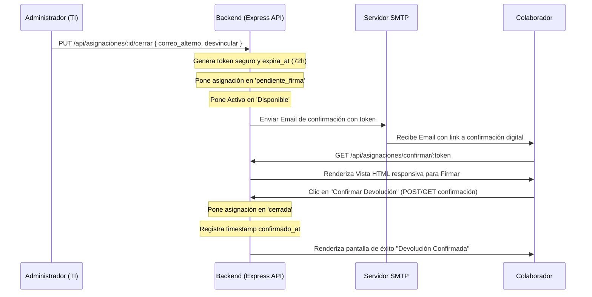

# Contexto Maestro de Proyecto: IT COMPASS (Inventario TI Domino's Pizza Chile)

Este documento centraliza toda la información técnica, lógica, operativa y de base de datos de **IT COMPASS** (versión actual: **v1.2.1**), optimizado para que agentes AI como **Claude Code** entiendan el codebase al instante.

---

## 📋 Descripción del Sistema
**IT COMPASS** es una aplicación web autohospedada para la administración del inventario de TI de **Domino's Pizza Chile**, migrado recientemente de Supabase a un stack propio en contenedores Docker de PostgreSQL + Node.js + React.

### Ejes de Negocio
1.  **Activos (Equipos TI)**: Laptops, Desktops, Smartphones, SIM Cards con sus marcas, modelos, series, IMEIs, IMSIs, números telefónicos y compañías telefónicas.
2.  **Colaboradores**: Empleados activos de la compañía asociados a un RUT, cargo, correo y área de trabajo.
3.  **Asignaciones (Tercer Eje)**: Controla el historial de asignaciones y devoluciones con marcas temporales, notas y un sistema de firma/confirmación digital por correo.

---

## 🛠️ Stack Tecnológico
*   **Base de Datos**: PostgreSQL 15-alpine (Dockerizado).
*   **Backend API**: Node.js v20 (Express, controlador `pg` nativo, `nodemailer` para SMTP, `jsonwebtoken` para tokens).
*   **Frontend**: React (Vite, Zustand para store de estados, Tailwind CSS, Lucide icons, React Hook Form + Zod para validación).
*   **Infraestructura**: Docker Compose (`docker-compose.yml` para desarrollo, `docker-compose.prod.yml` para producción).

---

## 📁 Estructura del Workspace
```text
inventario-dominos/
├── backend/
│   ├── migrations/                # Scripts SQL de migraciones correlativas
│   │   ├── 004_asignaciones.sql   # Esquema Tercer Eje y Vista v_activos
│   │   └── 005_crear_tabla_areas.sql # Tabla areas y eliminación check constraint
│   ├── db.js                      # Capa de datos (Consultas SQL parametrizadas)
│   ├── mail.js                    # Plantillas de correo y envíos SMTP
│   ├── server.js                  # Rutas API Express y confirmación pública de devoluciones
│   ├── run-migration.js           # CLI dinámico para correr migraciones SQL
│   ├── migrate-asignaciones.js    # Script de migración de datos anteriores
│   ├── schema.sql                 # Script maestro de inicialización de la Base de Datos
│   ├── Dockerfile
│   └── package.json
├── frontend/
│   ├── src/
│   │   ├── components/            # Modales (ModalAsignacion, ModalDevolucion, ModalColaborador)
│   │   ├── pages/                 # Páginas (ActivosPage, ColaboradoresPage, HistorialPage, AjustesPage)
│   │   ├── store/                 # Zustand (activosStore.js)
│   │   ├── authConfig.js          # Configuración del Cliente Azure MSAL
│   │   ├── msalInstance.js        # Inicialización de PublicClientApplication de MSAL
│   │   ├── api.js                 # Cliente Axios y catálogo de APIs
│   │   └── main.jsx
│   ├── Dockerfile.prod            # Contenedor de producción con Nginx serving static files
│   └── package.json
├── docker-compose.yml             # Orquestación desarrollo local
└── docker-compose.prod.yml        # Orquestación producción (Frontend: 8080, Backend: 8081)
```

---

## ⚙️ Variables de Entorno (`.env`)

Tanto en desarrollo local como en producción, las siguientes variables son configuradas en el archivo `.env` o `.env.production` en la raíz del repositorio:

```ini
PORT=8081                        # Puerto de escucha del backend
NODE_ENV=production              # Modo ('development' o 'production')

# Conexión a PostgreSQL
DB_HOST=db                       # 'localhost' localmente, 'db' en docker-compose
DB_PORT=5432
DB_NAME=inventario_db
DB_USER=inventario_user
DB_PASSWORD=contrasena_secreta_aqui
DB_SSL=false                     # 'true' para forzar conexiones SSL

# Seguridad JWT (Sesión Tradicional)
JWT_SECRET=un_secreto_largo_y_aleatorio_aqui
JWT_EXPIRES_IN=12h

# Servidor SMTP (Notificaciones por Correo)
SMTP_HOST=smtp.office365.com     # Servidor SMTP de tu proveedor
SMTP_PORT=587                    # Puerto SMTP (ej. 587 para TLS)
SMTP_USER=ti@dominospizza.cl     # Cuenta de correo origen
SMTP_PASSWORD=contrasena_smtp_aqui
EMAIL_FROM=noreply@dominospizza.cl

# Integración de Enrutamiento
FRONTEND_URL=http://tu-dominio-inventario.cl:8080 # Dominio principal del Frontend
BACKEND_URL=http://tu-dominio-api.cl:8081        # Endpoint principal del Backend (usado para links de confirmación)
```

---

## 🔐 Autenticación y Seguridad

El sistema soporta dos vías de autenticación concurrentes controladas en `backend/server.js`:

### 1. Autenticación Local
*   Usa credenciales tradicionales (correo y contraseña).
*   Las contraseñas se encriptan con `bcryptjs` (salt de 10).
*   Se genera un token JWT firmado mediante `jsonwebtoken` que se retorna al cliente y se valida a través del middleware `authenticate`.

### 2. Autenticación Microsoft (MSAL / Azure Entra ID)
*   **Frontend**: Inicializa MSAL usando `@azure/msal-browser` con el `clientId` `4361c762-9ecd-4da0-b136-dafcbb63aa7f` y el tenant `796cb01d-5824-4199-9177-a82623fb5e38` de Domino's Pizza.
*   Al hacer login con Microsoft, el frontend obtiene el token de acceso (`access_token`) y el email del colaborador de Azure AD.
*   **Backend**: Recibe el token de Microsoft mediante el endpoint `/api/auth/msal-login`, valida que pertenezca al dominio Domino's, verifica si el usuario existe en la tabla `usuarios` y le genera un token JWT interno de sesión del sistema.

---

## 🗄️ Modelo de Base de Datos (PostgreSQL)

### Tablas Principales:
1.  **`usuarios`**:
    *   `id` SERIAL PRIMARY KEY
    *   `email` VARCHAR(255) UNIQUE NOT NULL
    *   `nombre` VARCHAR(255) NOT NULL
    *   `password` VARCHAR(255) NOT NULL (bcrypt hash)
    *   `rol` VARCHAR(50) CHECK IN (`admin`, `viewer`, `superadministrador`)
    *   `pin` VARCHAR(255) (opcional, para firma/seguridad del dashboard antiguo)
2.  **`colaboradores`**:
    *   `id` SERIAL PRIMARY KEY
    *   `rut` VARCHAR(50) UNIQUE NOT NULL (Formato normalizado sin puntos: `12345678-9`)
    *   `nombre` VARCHAR(255) NOT NULL
    *   `correo` VARCHAR(255)
    *   `area` VARCHAR(100) NOT NULL (Ej: `Operaciones`, `Administración`, `TI`, `RRHH`, `Marketing`, etc.)
    *   `cargo` VARCHAR(255), `telefono` VARCHAR(20), `activo` BOOLEAN
3.  **`areas`**:
    *   `id` SERIAL PRIMARY KEY
    *   `nombre` VARCHAR(255) UNIQUE NOT NULL
4.  **`activos`**:
    *   `id` SERIAL PRIMARY KEY
    *   `serie` VARCHAR(100) UNIQUE NOT NULL
    *   `marca` y `modelo` VARCHAR(100) NOT NULL
    *   `estado` VARCHAR(50) CHECK IN (`Asignado`, `Disponible`, `Mantenimiento`, `Descartado`)
    *   `tipo_dispositivo` VARCHAR(100) CHECK IN (`Laptop`, `Desktop`, `Smartphone`, `Tablet`, `SIM Card`, `Impresora`, `Monitor`, `Servidor`, `Otro`)
    *   `rut_responsable` VARCHAR(50) REFERENCES `colaboradores(rut)` ON DELETE SET NULL
    *   `imei` VARCHAR(50), `numero_sim` VARCHAR(50), `imsi` VARCHAR(50), `numero_telefono` VARCHAR(50), `compania` VARCHAR(100)
5.  **`asignaciones`**:
    *   `id` SERIAL PRIMARY KEY
    *   `serie_activo` REFERENCES `activos(serie)` ON DELETE CASCADE
    *   `rut_colaborador` REFERENCES `colaboradores(rut)` ON DELETE CASCADE
    *   `fecha_inicio` TIMESTAMP DEFAULT NOW(), `fecha_fin` TIMESTAMP
    *   `entregado_por` VARCHAR(255), `motivo_devolucion` VARCHAR(100), `estado_fisico_devolucion` VARCHAR(50), `notas` TEXT
    *   `token_confirmacion` VARCHAR(100) UNIQUE, `token_expira_at` TIMESTAMP, `confirmado_at` TIMESTAMP, `confirmado_via` VARCHAR(50)
    *   `estado` VARCHAR(20) DEFAULT `'activa'` CHECK IN (`activa`, `cerrada`, `pendiente_firma`, `cancelada`)
6.  **`historial_activos`**: Trazabilidad completa de auditoría e historial.

### Vistas Críticas:
*   **`v_activos`**: Expone todos los activos relacionándolos con su responsable directo (`colaboradores`) y los datos de su asignación activa actual (`asignacion_id`, `asignacion_fecha_inicio`, `asignacion_entregado_por`).

---

## 📡 Catálogo de la API (Endpoints Backend)

Todos los endpoints (excepto el login, recuperación de clave y confirmación pública) requieren autorización mediante cabecera Bearer Token (`Authorization: Bearer <JWT_TOKEN>`).

### Autenticación
*   `POST /api/auth/login`: Login local con email y password.
*   `POST /api/auth/msal-login`: Login con token de Microsoft Azure AD.
*   `GET /api/auth/verify`: Verifica validez de sesión.
*   `POST /api/auth/forgot-password`: Generación de token temporal de recuperación.
*   `POST /api/auth/reset-password`: Reseteo de contraseña usando token temporal.

### Usuarios (Administración)
*   `GET /api/usuarios`: Listar usuarios.
*   `POST /api/usuarios`: Crear usuario (Rol: `admin` o `superadministrador` requerido).
*   `PUT /api/usuarios/:id`: Modificar datos y rol de usuario.
*   `DELETE /api/usuarios/:id`: Eliminar usuario.

### Activos (Equipos TI)
*   `GET /api/activos`: Obtiene listado de activos mediante la vista `v_activos`.
*   `POST /api/activos`: Crear un nuevo activo.
*   `GET /api/activos/:serie`: Obtener un activo específico.
*   `PUT /api/activos/:serie`: Actualizar datos físicos y estado del activo.
*   `DELETE /api/activos/:serie`: Ocultación lógica (Soft Delete) del activo.

### Colaboradores
*   `GET /api/colaboradores`: Listar todos los colaboradores.
*   `POST /api/colaboradores`: Crear colaborador.
*   `PUT /api/colaboradores/:rut`: Actualizar colaborador.
*   `DELETE /api/colaboradores/:rut`: Ocultación lógica del colaborador y desasignación automática de sus equipos.
*   `GET /api/colaboradores/:rut/activos`: Obtener activos actualmente asignados a un colaborador.

### Áreas (Lista Maestra)
*   `GET /api/areas`: Retorna la lista maestra de áreas de la tabla `areas`.
*   `POST /api/areas`: Crea un área en la lista maestra.
*   `PUT /api/areas/:id`: Renombrar área.
*   `DELETE /api/areas/:id`: Eliminar área de la lista maestra.

### Asignaciones (Tercer Eje)
*   `GET /api/asignaciones`: Obtener lista de asignaciones filtradas.
*   `POST /api/asignaciones`: Asignar equipo disponible a un colaborador. Genera registro de asignación activa, actualiza el estado del activo a `'Asignado'` y gatilla alerta por mail a RRHH.
*   `PUT /api/asignaciones/:id/cerrar`: Solicitar devolución. Cierra la asignación física, cambia el estado de la asignación a `'pendiente_firma'`, y envía el enlace con token digital para la firma al colaborador (vía correo corporativo o personal).
*   `GET /api/asignaciones/confirmar/:token`: **[ENDPOINT PÚBLICO]** Renderiza el panel HTML responsivo de confirmación digital. Cuando el colaborador da clic en "Confirmar", cambia el estado de la asignación a `'cerrada'` y actualiza la fecha de confirmación.

### Reportería e Importaciones
*   `GET /api/historial`: Reporte e historial de auditoría de movimientos.
*   `GET /api/kpis`: Métricas y estadísticas para el Dashboard (totales, por estado, por tipo, alertas de IMEIs y SIMs duplicados).
*   `POST /api/importar`: Importación masiva de activos y colaboradores desde planillas Excel.
*   `GET /api/exportar`: Exportación masiva de todo el inventario consolidado a un archivo Excel (.xlsx).

---

## 🔄 Flujo de Firma y Confirmación Digital en Devoluciones



---

## 🛠️ Comandos de Operación en Producción (Docker)

### 1. Actualizar el Servidor:
```bash
git pull origin main
docker compose -f docker-compose.prod.yml up -d --build
```

### 2. Ejecutar Migraciones de Base de Datos:
```bash
# Migración 004 (Tabla de Asignaciones)
docker exec -it inventario_backend_prod node run-migration.js 004_asignaciones.sql

# Migración 005 (Tabla de Áreas y Constraints)
docker exec -it inventario_backend_prod node run-migration.js 005_crear_tabla_areas.sql
```

### 3. Migrar los Datos de Asignación Existentes:
```bash
docker exec -it inventario_backend_prod node migrate-asignaciones.js
```

### 4. Monitorear logs del sistema en caliente:
```bash
docker logs -f inventario_backend_prod
```
